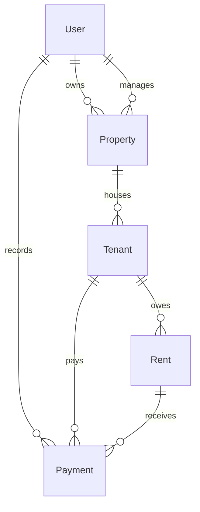
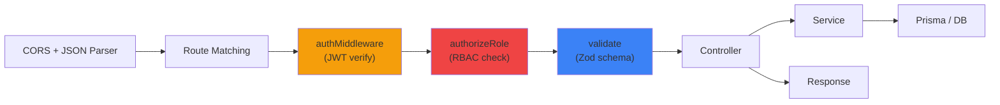

# 📋 Backend System Report
### Property & Tenant Management System
**Generated**: 14 April 2026 | **Files**: 30 | **Endpoints**: 18 | **Models**: 5

---

## 1. Complete Folder Structure

```
backend/
├── .env.example                          # Environment variable template
├── package.json                          # Dependencies & scripts
├── tsconfig.json                         # TypeScript configuration
└── src/
    ├── index.ts                          # Server entry point + graceful shutdown
    ├── controllers/                      # HTTP request handlers (7 files)
    │   ├── auth.controller.ts
    │   ├── user.controller.ts
    │   ├── property.controller.ts
    │   ├── tenant.controller.ts
    │   ├── rent.controller.ts
    │   ├── payment.controller.ts
    │   └── report.controller.ts
    ├── services/                         # Business logic layer (7 files)
    │   ├── auth.service.ts
    │   ├── user.service.ts
    │   ├── property.service.ts
    │   ├── tenant.service.ts
    │   ├── rent.service.ts
    │   ├── payment.service.ts
    │   └── report.service.ts
    ├── routes/                           # Route definitions + middleware chains (8 files)
    │   ├── index.ts                      # Root router aggregator
    │   ├── auth.routes.ts
    │   ├── user.routes.ts
    │   ├── property.routes.ts
    │   ├── tenant.routes.ts
    │   ├── rent.routes.ts
    │   ├── payment.routes.ts
    │   └── report.routes.ts
    ├── middlewares/                       # Cross-cutting concerns (3 files)
    │   ├── auth.ts                       # JWT verification + RBAC
    │   ├── validate.ts                   # Zod schema validation
    │   └── error.ts                      # Global error handler
    ├── validations/                      # Zod schemas (4 files)
    │   ├── user.schema.ts
    │   ├── property.schema.ts
    │   ├── tenant.schema.ts
    │   └── payment.schema.ts
    ├── prisma/                           # Database layer (3 files)
    │   ├── schema.prisma                 # Data model
    │   ├── client.ts                     # Prisma singleton
    │   └── seed.ts                       # Test data seeder
    ├── utils/                            # Shared utilities (3 files)
    │   ├── auth.ts                       # JWT + Bcrypt helpers
    │   ├── response.ts                   # Response envelope + AppError class
    │   └── asyncHandler.ts               # Async middleware wrapper
    └── types/                            # TypeScript declarations (1 file)
        └── express.d.ts                  # Express Request augmentation
```

**Total**: 30 source files across 9 directories.

---

## 2. Tech Stack

| Layer | Technology | Version |
|:------|:-----------|:--------|
| Runtime | Node.js | TypeScript |
| Framework | Express.js | ^4.19.2 |
| ORM | Prisma | ^5.x |
| Database | PostgreSQL | — |
| Validation | Zod | ^3.23.8 |
| Auth | jsonwebtoken | ^9.0.2 |
| Hashing | bcrypt | ^5.1.1 |
| Dev Server | ts-node-dev | ^2.0.0 |

---

## 3. Database Models (Prisma Schema)

### 3.1 Enums

| Enum | Values |
|:-----|:-------|
| `Role` | `ADMIN`, `MANAGER`, `COLLECTOR` |
| `RentStatus` | `PENDING`, `PARTIAL`, `PAID`, `OVERDUE` |
| `PaymentMethod` | `CASH`, `UPI`, `BANK` |

### 3.2 User Model

| Field | Type | Constraints |
|:------|:-----|:------------|
| `id` | UUID | PK, auto-generated |
| `name` | String | Required |
| `email` | String | **Unique**, indexed |
| `password` | String | Bcrypt hashed, never returned |
| `role` | Role enum | Required |
| `isActive` | Boolean | Default: `true` |
| `lastLoginAt` | DateTime | Nullable |
| `createdAt` | DateTime | Auto |
| `updatedAt` | DateTime | Auto |

**Relations**: `ownedProperties[]`, `managedProperties[]`, `paymentsCreated[]`
**Indexes**: `email`, `role`

### 3.3 Property Model

| Field | Type | Constraints |
|:------|:-----|:------------|
| `id` | UUID | PK, auto-generated |
| `name` | String | Required |
| `address` | String | Required |
| `isActive` | Boolean | Default: `true` |
| `ownerId` | UUID | FK → User (must be ADMIN) |
| `managerId` | UUID? | FK → User (nullable, MANAGER or ADMIN) |
| `createdAt` | DateTime | Auto |
| `updatedAt` | DateTime | Auto |

**Relations**: `owner`, `manager`, `tenants[]`
**Indexes**: `ownerId`, `managerId`, `isActive`

### 3.4 Tenant Model

| Field | Type | Constraints |
|:------|:-----|:------------|
| `id` | UUID | PK, auto-generated |
| `name` | String | Required, min 2 chars |
| `phone` | String | Required, exactly 10 digits |
| `moveInDate` | DateTime | Required |
| `rentAmount` | Decimal(10,2) | Default: 0 |
| `isActive` | Boolean | Default: `true` |
| `propertyId` | UUID | FK → Property |
| `createdAt` | DateTime | Auto |
| `updatedAt` | DateTime | Auto |

**Relations**: `property`, `rents[]`, `payments[]`
**Indexes**: `propertyId`, `isActive`

### 3.5 Rent Model

| Field | Type | Constraints |
|:------|:-----|:------------|
| `id` | UUID | PK, auto-generated |
| `amount` | Decimal(10,2) | From tenant.rentAmount |
| `dueDate` | DateTime | Required |
| `status` | RentStatus | Default: `PENDING` |
| `generatedMonth` | String | Format: `YYYY-MM` |
| `tenantId` | UUID | FK → Tenant |
| `createdAt` | DateTime | Auto |
| `updatedAt` | DateTime | Auto |

**Unique constraint**: `(tenantId, generatedMonth)` — prevents duplicate rent per month
**Relations**: `tenant`, `payments[]`
**Indexes**: `tenantId`, `status`, `generatedMonth`

### 3.6 Payment Model

| Field | Type | Constraints |
|:------|:-----|:------------|
| `id` | UUID | PK, auto-generated |
| `amount` | Decimal(10,2) | Must be > 0 |
| `paymentDate` | DateTime | Default: `now()` |
| `method` | PaymentMethod | Required |
| `referenceId` | String? | Optional (UPI ref, cheque no.) |
| `tenantId` | UUID | FK → Tenant |
| `rentId` | UUID | FK → Rent |
| `createdById` | UUID | FK → User (who recorded it) |
| `createdAt` | DateTime | Auto |

**Immutable**: No `updatedAt` — payments cannot be edited after creation
**Relations**: `tenant`, `rent`, `createdBy`
**Indexes**: `tenantId`, `rentId`, `createdById`, `paymentDate`

### 3.7 Entity Relationship Diagram



---

## 4. Complete API Endpoint Reference

### 4.1 Auth (`/api/auth`)

| Method | Endpoint | Auth | Role | Validation | Description |
|:-------|:---------|:-----|:-----|:-----------|:------------|
| `POST` | `/api/auth/login` | ❌ Public | Any | `loginSchema` | Authenticate & receive JWT |

**Request**: `{ email, password }`
**Response**: `{ success, data: { user, token }, message }`

---

### 4.2 Users (`/api/users`)

| Method | Endpoint | Auth | Role | Validation | Description |
|:-------|:---------|:-----|:-----|:-----------|:------------|
| `GET` | `/api/users` | ✅ | ADMIN | — | List all users (paginated) |
| `GET` | `/api/users/:id` | ✅ | ADMIN | — | Get user by ID |
| `POST` | `/api/users` | ✅ | ADMIN | `createUserSchema` | Create new user |
| `PATCH` | `/api/users/:id/status` | ✅ | ADMIN | `updateStatusSchema` | Activate/Deactivate user |

---

### 4.3 Properties (`/api/properties`)

| Method | Endpoint | Auth | Role | Validation | Description |
|:-------|:---------|:-----|:-----|:-----------|:------------|
| `GET` | `/api/properties` | ✅ | ADMIN, MANAGER | — | List properties (RBAC filtered) |
| `GET` | `/api/properties/:id` | ✅ | ADMIN, MANAGER | — | Get property detail (ownership check) |
| `POST` | `/api/properties` | ✅ | ADMIN | `createPropertySchema` | Create property |
| `PATCH` | `/api/properties/:id` | ✅ | ADMIN, MANAGER | `updatePropertySchema` | Update property (ownership check) |

---

### 4.4 Tenants (`/api/tenants`)

| Method | Endpoint | Auth | Role | Validation | Description |
|:-------|:---------|:-----|:-----|:-----------|:------------|
| `GET` | `/api/tenants` | ✅ | All | — | List tenants (filter by `?propertyId=`) |
| `GET` | `/api/tenants/:id` | ✅ | All | — | Get tenant with recent rents |
| `POST` | `/api/tenants` | ✅ | ADMIN, MANAGER | `createTenantSchema` | Add new tenant |
| `PATCH` | `/api/tenants/:id` | ✅ | ADMIN, MANAGER | `updateTenantSchema` | Update tenant details |

---

### 4.5 Rents (`/api/rents`)

| Method | Endpoint | Auth | Role | Validation | Description |
|:-------|:---------|:-----|:-----|:-----------|:------------|
| `GET` | `/api/rents` | ✅ | All | — | List rents (filter: `?tenantId=`, `?status=`, `?month=`) |
| `GET` | `/api/rents/:id` | ✅ | All | — | Get rent with all payments |
| `POST` | `/api/rents/generate` | ✅ | ADMIN | `generateRentSchema` | Bulk generate monthly rents |
| `POST` | `/api/rents/mark-overdue` | ✅ | ADMIN | — | Mark past-due rents as OVERDUE |

---

### 4.6 Payments (`/api/payments`)

| Method | Endpoint | Auth | Role | Validation | Description |
|:-------|:---------|:-----|:-----|:-----------|:------------|
| `GET` | `/api/payments` | ✅ | All | — | Payment history (filter: `?tenantId=`, `?method=`) |
| `POST` | `/api/payments` | ✅ | ADMIN, COLLECTOR | `createPaymentSchema` | Record a payment (transactional) |

---

### 4.7 Reports (`/api/reports`)

| Method | Endpoint | Auth | Role | Validation | Description |
|:-------|:---------|:-----|:-----|:-----------|:------------|
| `GET` | `/api/reports/stats` | ✅ | ADMIN, MANAGER | — | Dashboard statistics |

**Response fields**: `totalProperties`, `totalTenants`, `totalRevenue`, `monthlyRevenue`, `pendingRents`, `overdueRents`, `recentPayments[]`

---

### 4.8 Infrastructure

| Method | Endpoint | Auth | Description |
|:-------|:---------|:-----|:------------|
| `GET` | `/ping` | ❌ | Health check — returns `{ status: "ok", timestamp }` |
| `*` | Any undefined | — | Returns `{ success: false, message: "Route not found", code: "NOT_FOUND" }` |

---

## 5. Standardized API Response Formats

### Success Response
```json
{
  "success": true,
  "data": { ... },
  "message": "Operation successful"
}
```

### Paginated Response
```json
{
  "success": true,
  "data": [ ... ],
  "meta": {
    "page": 1,
    "limit": 10,
    "total": 47,
    "totalPages": 5
  }
}
```

### Error Response
```json
{
  "success": false,
  "message": "Description of what went wrong",
  "code": "BUSINESS_RULE_ERROR"
}
```

### Validation Error Response
```json
{
  "success": false,
  "message": "Validation failed",
  "code": "VALIDATION_ERROR",
  "errors": [
    { "field": "body.email", "message": "Invalid email address" },
    { "field": "body.password", "message": "Password must be at least 6 characters" }
  ]
}
```

---

## 6. Middleware Pipeline

Every request flows through this pipeline (in order):



### 6.1 `authMiddleware` — [auth.ts](file:///c:/Users/Shhruzz/Documents/designpro/Afzal%20sir%20Coding/Tenant_management/backend/src/middlewares/auth.ts)
- Extracts Bearer token from `Authorization` header
- Verifies JWT signature and expiration
- Attaches `{ id, role }` to `req.user`
- Returns 401 on failure (uses `next(error)`, not `throw`)

### 6.2 `authorizeRole(roles[])` — [auth.ts](file:///c:/Users/Shhruzz/Documents/designpro/Afzal%20sir%20Coding/Tenant_management/backend/src/middlewares/auth.ts)
- Higher-order function: `authorizeRole(['ADMIN', 'MANAGER'])`
- Checks `req.user.role` against allowed roles
- Returns 403 with role name in error message

### 6.3 `validate(schema)` — [validate.ts](file:///c:/Users/Shhruzz/Documents/designpro/Afzal%20sir%20Coding/Tenant_management/backend/src/middlewares/validate.ts)
- Validates `req.body`, `req.query`, `req.params` against Zod schema
- Writes parsed/coerced values back onto request (clean types for downstream)
- Returns structured per-field errors on failure

### 6.4 `errorHandler` — [error.ts](file:///c:/Users/Shhruzz/Documents/designpro/Afzal%20sir%20Coding/Tenant_management/backend/src/middlewares/error.ts)
- Catches all errors (must be last middleware)
- Handles: `AppError`, `ZodError`, Prisma `P2002`/`P2025`/`P2003`, JWT errors
- Environment-aware logging (full stack in dev, message-only in prod)
- Never leaks stack traces to clients

---

## 7. Validation Schemas (Zod)

### 7.1 [user.schema.ts](file:///c:/Users/Shhruzz/Documents/designpro/Afzal%20sir%20Coding/Tenant_management/backend/src/validations/user.schema.ts)

| Schema | Fields | Rules |
|:-------|:-------|:------|
| `loginSchema` | `email`, `password` | email format, min 6 chars, trim + lowercase |
| `createUserSchema` | `name`, `email`, `password`, `role` | min 2 name, email format, min 6 / max 128 password, enum role |
| `updateStatusSchema` | `isActive`, `params.id` | boolean required, UUID param |
| `paginationSchema` | `page`, `limit`, `sort` | coerced integers, defaults 1/10, max 100 limit |

### 7.2 [property.schema.ts](file:///c:/Users/Shhruzz/Documents/designpro/Afzal%20sir%20Coding/Tenant_management/backend/src/validations/property.schema.ts)

| Schema | Fields | Rules |
|:-------|:-------|:------|
| `createPropertySchema` | `name`, `address`, `ownerId`, `managerId?` | min 2/5, UUID, nullable managerId |
| `updatePropertySchema` | `name?`, `address?`, `managerId?`, `isActive?` | At least one field required (refine) |

### 7.3 [tenant.schema.ts](file:///c:/Users/Shhruzz/Documents/designpro/Afzal%20sir%20Coding/Tenant_management/backend/src/validations/tenant.schema.ts)

| Schema | Fields | Rules |
|:-------|:-------|:------|
| `createTenantSchema` | `name`, `phone`, `propertyId`, `rentAmount`, `moveInDate` | min 2, exactly 10 digits (regex), UUID, positive decimal, ISO date |
| `updateTenantSchema` | `name?`, `phone?`, `rentAmount?`, `isActive?` | At least one field required (refine) |

### 7.4 [payment.schema.ts](file:///c:/Users/Shhruzz/Documents/designpro/Afzal%20sir%20Coding/Tenant_management/backend/src/validations/payment.schema.ts)

| Schema | Fields | Rules |
|:-------|:-------|:------|
| `createPaymentSchema` | `amount`, `rentId`, `tenantId`, `method`, `referenceId?` | positive number, UUIDs, enum, optional string |

### 7.5 Rent Generation (inline in [rent.routes.ts](file:///c:/Users/Shhruzz/Documents/designpro/Afzal%20sir%20Coding/Tenant_management/backend/src/routes/rent.routes.ts))

| Schema | Fields | Rules |
|:-------|:-------|:------|
| `generateRentSchema` | `month`, `dueDate` | regex `YYYY-MM`, valid ISO date |

---

## 8. Business Logic (Service Layer)

### 8.1 Auth Service — [auth.service.ts](file:///c:/Users/Shhruzz/Documents/designpro/Afzal%20sir%20Coding/Tenant_management/backend/src/services/auth.service.ts)

| Function | Logic |
|:---------|:------|
| `login(email, password)` | 1. Find user by email  2. **Always** run bcrypt compare (timing-attack mitigation)  3. Check `isActive`  4. Generate JWT with `{ id, role }`  5. Update `lastLoginAt` (fire-and-forget)  6. Return user (without password) + token |

### 8.2 User Service — [user.service.ts](file:///c:/Users/Shhruzz/Documents/designpro/Afzal%20sir%20Coding/Tenant_management/backend/src/services/user.service.ts)

| Function | Logic |
|:---------|:------|
| `createUser(data)` | Check email uniqueness (409) → hash password → create with safe select |
| `getAllUsers(page, limit, includeInactive)` | Paginated list, includes deactivated users for Admin visibility |
| `getUserById(id)` | Returns user or throws 404 |
| `toggleUserStatus(id, isActive)` | Verify existence → update status (soft delete/restore) |

### 8.3 Property Service — [property.service.ts](file:///c:/Users/Shhruzz/Documents/designpro/Afzal%20sir%20Coding/Tenant_management/backend/src/services/property.service.ts)

| Function | Logic |
|:---------|:------|
| `createProperty(data)` | Verify owner is ADMIN → verify manager role & active status → create |
| `getProperties(user, page, limit)` | **RBAC**: Managers see ONLY their assigned properties; Admins see all |
| `getPropertyById(id, user)` | **RBAC ownership check**: Managers can only view their own properties |
| `updateProperty(id, data, user)` | **RBAC**: Only admin or assigned manager can update; validates new manager role |

### 8.4 Tenant Service — [tenant.service.ts](file:///c:/Users/Shhruzz/Documents/designpro/Afzal%20sir%20Coding/Tenant_management/backend/src/services/tenant.service.ts)

| Function | Logic |
|:---------|:------|
| `createTenant(data)` | Verify property exists AND is active → create with rentAmount |
| `getTenants(propertyId?, page, limit)` | Paginated list filtered by property, defaults to active-only |
| `getTenantById(id)` | Returns tenant with last 5 rents |
| `updateTenant(id, data)` | Verify existence → update fields |

### 8.5 Rent Service — [rent.service.ts](file:///c:/Users/Shhruzz/Documents/designpro/Afzal%20sir%20Coding/Tenant_management/backend/src/services/rent.service.ts)

| Function | Logic |
|:---------|:------|
| `generateMonthlyRents(month, dueDate)` | 1. Validate month format  2. Fetch all active tenants  3. **Batch query** existing rents for month (no N+1)  4. Filter out duplicates + zero-rent tenants  5. **Batch create** inside transaction  6. Return counts: generated, skipped, skippedZeroRent |
| `getRents(filters, page, limit)` | Filter by `tenantId`, `status`, `month` with pagination |
| `getRentById(id)` | Returns rent with all associated payments |
| `markOverdueRents()` | Updates `PENDING` → `OVERDUE` where `dueDate < now()` |

### 8.6 Payment Service — [payment.service.ts](file:///c:/Users/Shhruzz/Documents/designpro/Afzal%20sir%20Coding/Tenant_management/backend/src/services/payment.service.ts)

| Function | Logic |
|:---------|:------|
| `processPayment(data, collectorId)` | **Atomic transaction**: 1. Fetch rent + payments  2. Verify tenant-rent relationship  3. Reject if rent already PAID  4. Calculate balance, reject overpayment  5. Create payment with explicit field mapping  6. Update rent status (PARTIAL or PAID)  7. Return payment + new status + remaining balance |
| `getPaymentHistory(filters, page, limit)` | Filter by `tenantId`, `method` with pagination |

### 8.7 Report Service — [report.service.ts](file:///c:/Users/Shhruzz/Documents/designpro/Afzal%20sir%20Coding/Tenant_management/backend/src/services/report.service.ts)

| Function | Logic |
|:---------|:------|
| `getDashboardStats()` | **7 parallel queries**: property count, tenant count, total revenue, pending rents, overdue rents, recent 10 payments, current month revenue |

---

## 9. Role-Based Access Control (RBAC)

| Action | ADMIN | MANAGER | COLLECTOR |
|:-------|:-----:|:-------:|:---------:|
| Login | ✅ | ✅ | ✅ |
| Create users | ✅ | ❌ | ❌ |
| View/manage all users | ✅ | ❌ | ❌ |
| Create properties | ✅ | ❌ | ❌ |
| View properties | ✅ All | ✅ Own only | ❌ |
| Update properties | ✅ | ✅ Own only | ❌ |
| Create tenants | ✅ | ✅ | ❌ |
| View tenants | ✅ | ✅ | ✅ |
| Update tenants | ✅ | ✅ | ❌ |
| View rents | ✅ | ✅ | ✅ |
| Generate rents | ✅ | ❌ | ❌ |
| Mark overdue | ✅ | ❌ | ❌ |
| Record payments | ✅ | ❌ | ✅ |
| View payment history | ✅ | ✅ | ✅ |
| View dashboard stats | ✅ | ✅ | ❌ |

---

## 10. Edge Cases Handled

| Edge Case | Where | What Happens |
|:----------|:------|:-------------|
| Overpayment | `payment.service.ts` | Rejected with remaining balance shown: `₹{balance}` |
| Duplicate rent for same month | `rent.service.ts` + DB unique constraint | Skipped silently during generation (count returned) |
| Payment on PAID rent | `payment.service.ts` | Rejected: "This rent is already fully paid" |
| Tenant-rent mismatch | `payment.service.ts` | Rejected: "This rent does not belong to the specified tenant" |
| Inactive user login | `auth.service.ts` | Rejected: "Account is deactivated" (after password check) |
| Tenant on inactive property | `tenant.service.ts` | Rejected: "Cannot add tenant to a deactivated property" |
| Manager viewing other's property | `property.service.ts` | 403 Forbidden |
| Manager updating other's property | `property.service.ts` | 403 Forbidden |
| Assigning inactive user as manager | `property.service.ts` | Rejected: "Cannot assign an inactive user as manager" |
| Owner is not ADMIN | `property.service.ts` | Rejected: "Only users with ADMIN role can be property owners" |
| Zero rent amount tenant | `rent.service.ts` | Skipped during generation (count returned) |
| Invalid month format | `rent.service.ts` | Rejected: "Month must be in YYYY-MM format" |
| Undefined API route | `index.ts` | 404 with standard error response |
| Missing JWT_SECRET | `utils/auth.ts` | **Server refuses to start** |
| Timing attack on login | `auth.service.ts` | Bcrypt always runs even for nonexistent users |
| Password DoS | `user.schema.ts` | Max 128 chars (prevents bcrypt with megabyte payloads) |
| Prisma duplicate (P2002) | `error.ts` | 409 with target field name |
| Prisma not found (P2025) | `error.ts` | 404 |
| Prisma FK violation (P2003) | `error.ts` | 400 |
| JWT expired | `error.ts` | 401: "Token has expired" |
| Empty PATCH body | validation schemas | Rejected: "At least one field must be provided for update" |
| Concurrent payments | `payment.service.ts` | Prisma `$transaction` ensures atomic read-check-write |

---

## 11. Security Measures

| Measure | Implementation |
|:--------|:---------------|
| Password hashing | Bcrypt with 12 salt rounds |
| Password never returned | `USER_SELECT` constant excludes password from all queries |
| JWT stateless auth | Token contains `{ id, role }`, verified on every request |
| No hardcoded secrets | Server crashes if `JWT_SECRET` env var is missing |
| Timing-attack mitigation | Bcrypt compare runs even when user doesn't exist |
| Email normalization | `.trim().toLowerCase()` on all email inputs |
| CORS configured | `FRONTEND_URL` env var, credentials enabled |
| Body size limit | 10MB max JSON payload |
| Soft deletion | `isActive` flag on User, Property, Tenant — no hard deletes |
| Payment immutability | No `updatedAt` on Payment model — cannot be modified after creation |
| Input sanitization | Zod `.trim()` on all string inputs |

---

## 12. NPM Scripts

| Script | Command | Purpose |
|:-------|:--------|:--------|
| `npm run dev` | `ts-node-dev --respawn --transpile-only src/index.ts` | Development server with hot-reload |
| `npm start` | `node dist/index.js` | Production server |
| `npm run build` | `tsc` | TypeScript compilation |
| `npm run db:migrate` | `prisma migrate dev` | Run database migrations |
| `npm run db:generate` | `prisma generate` | Regenerate Prisma client |
| `npm run db:seed` | `ts-node src/prisma/seed.ts` | Seed test data |
| `npm run db:studio` | `prisma studio` | Open Prisma visual editor |
| `npm run db:reset` | `prisma migrate reset` | Reset database + rerun migrations |

---

## 13. Seed Data (Test Credentials)

| Role | Email | Password |
|:-----|:------|:---------|
| ADMIN | `admin@tenantmgmt.com` | `admin123` |
| MANAGER | `manager@tenantmgmt.com` | `manager123` |
| COLLECTOR | `collector@tenantmgmt.com` | `collector123` |

**Property**: Sunrise Apartments (123 Main Street, Block A)
**Tenants**: Rahul Sharma (₹15,000/month), Priya Patel (₹12,000/month)

---

## 14. Environment Variables

| Variable | Required | Default | Purpose |
|:---------|:--------:|:--------|:--------|
| `DATABASE_URL` | ✅ | — | PostgreSQL connection string |
| `JWT_SECRET` | ✅ | — | JWT signing key (server won't start without it) |
| `PORT` | ❌ | `5000` | Server port |
| `NODE_ENV` | ❌ | `development` | Controls logging verbosity |
| `JWT_EXPIRES_IN` | ❌ | `1d` | Token expiration duration |
| `FRONTEND_URL` | ❌ | `*` | CORS allowed origin |
